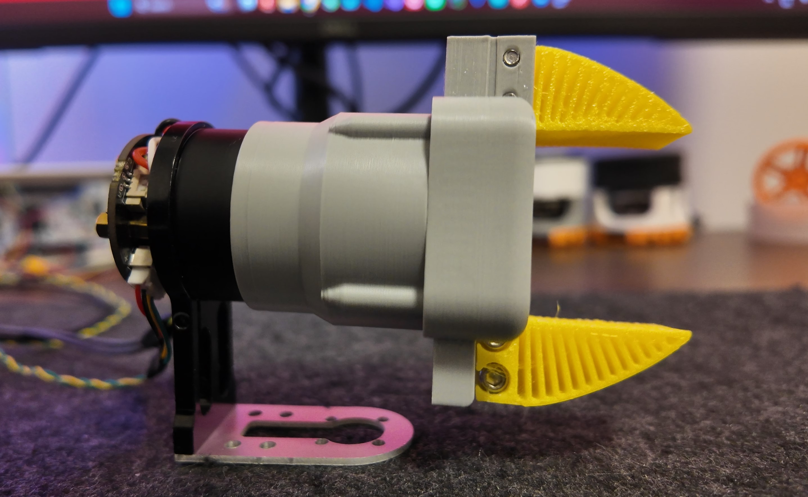
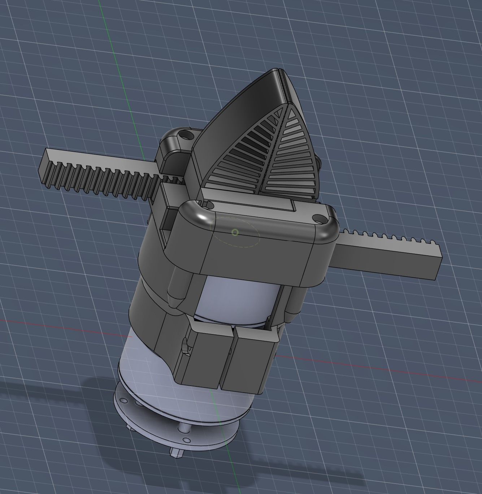

# Open-Gripper-mini

Compact 3D-printable gripper for robot arms — lightweight, modular, and easy to print.

Overview
- Small, open-source gripper designed for desktop and educational robot arms.
- Parts are provided as standard STEP/SLDPRT files and ready-to-print STL exports (see the `3D file` folder).

Video:

  

Gallery：

Contents
- `3D file/` — original CAD STEP model and related exports
- `Document/` — design notes, datasheets, and auxiliary files
- `Image/` — photos and renders (used above)
- `STM32-H723/` — STM32 microcontroller examples and firmware (unrelated to the gripper mech)

Getting started
1. Inspect the STEP files in `3D file/` with your CAD tool of choice.
2. Export to STL at desired tolerance for 3D printing.
3. Print recommended parts with 20% infill (adjust per strength requirements).

Assembly & usage
- Fasten parts with M2/M3 screws as shown in the provided drawings.
- Use a small servo or stepper with a suitable linkage to drive the finger mechanism.

License
This project is provided under the terms in `LICENSE`.

Contact
For questions or contributions, open an issue or pull request.

Enjoy building!
